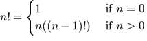

遞歸
你好遞歸！
=========

一些熟悉命令式和面向對象編程語言的讀者可能會感到好奇， 直到現在我們還沒有介紹任何與循環相關
的內容。回答這個問題之前我們得先問問“什麼是循環?”， 事情的真相是，函數式編程語言通常不會提供
像`for`和`while`這樣的構造塊。相反， 函數式編程語言依賴與一個被稱爲遞歸的幼稚的概念。

我想你應該還記得我們在簡介那一章是怎麼介紹不可變的變量的。如果忘記了， 可能你還需要花費更多的
精力在上面！ 我們可以使用數學和函數的概念來理解遞歸。數學上求一個數的階乘的函數可以作爲理解遞歸
的一個好例子。一個數n的階乘是`1 x 2 x 3 x ... x n`,或者 `n x (n-1) x (n-2) x ... x 1`. 例如，3
的階乘是 `3! = 3 x 2 x 1 = 6.`. 4的階乘是`4! = 4 x 3 x 2 x 1 = 24`. 因此我們可以用以下的數學
表示法來表示階乘的定義：



這個定義告訴我們， 如果n=0，階乘爲1， 如果n是大於0的數， 其階乘爲n乘以n-1的階乘：
```
4! = 4 x 3!
4! = 4 x 3 x 2!
4! = 4 x 3 x 2 x 1!
4! = 4 x 3 x 2 x 1 x 1
```
我們怎麼將這個數學表示法轉換爲Erlang的表示法呢？ 這個轉換實際上很簡單。讓我們看看數學表示法中的`n!`, 1
和`n(n-1)`, 和`如果`. 我們現在能想到的是函數(`n!`),保護式(`如果`), 和函數體(1和`n((n-1)!)`). 我們把`n!`
重新定義爲`fac(N)`,我們可以得到下面的實現：
```
-module(recursive).
-export([fac/1]).
 
fac(N) when N == 0 -> 1;
fac(N) when N > 0  -> N*fac(N-1).
```

我們就完成這個階乘的定義了！ 它和階乘的數學定義非常像。藉助模式匹配， 我們可以將函數的定義縮短一點：
```
fac(0) -> 1;
fac(N) when N > 0 -> N*fac(N-1).
```
編寫那些遞歸式的數學定義對應的Erlang函數相當簡單。我們確實循環了！遞歸的定義可以簡化爲"調用自身的函數"
但是我們需要找到停止的條件(術語稱爲基本情況), 否則的話我們將會無限地循環。在我們這個例子中， 停止的條件
是當n等於0的時候。當n等於0的時候，函數不再調用自身而是馬上停止。

求長度
=====

我們再來看一些實際的應用。我們將實現一個求給定列表長度的函數。我們需要知道：

    1. 基礎情況；
    2. 調用自身的函數；
    3. 使用一個list來測試我們的函數。

對於大多數遞歸函數， 我發現基礎情況是最容易編寫的：對於我們的函數來說， 什麼是最簡單的輸入？當然是空列表了，它
的長度是0.所以我們先記下`[] = 0`, 下一個最簡單的情況是當列表長度爲1的情況: `[_] = 1`. 有了這兩種情況我們就可以開始了：

```
len([]) -> 0;
len([_]) -> 1.
```

太棒了！現在我們可以計算長度爲0或者1的列表的長度了！這其實是非常有用的。但是實際上它還沒
啥用處， 因爲它還不時遞歸的。讓我們來考慮最難的部分：當列表長度大於1的時候調用它自身. 我們
早先提到過列表的定義是遞歸的：`[1 | [2] ... [n | []]]`. 這意味這我們可以使用 [H|T]來獲取列
表中一個或多個元素，對於一個長度爲1的列表它的定義應該是這樣的`[H|[]]`, 而長度爲2的列表其定義
爲`[X|[Y|[]]]`. 請注意第二個元素也是一個列表,這意味着我們可以計算第一個元素然後使用第二元素
來調用函數自身。假定列表中每個元素的長度都是1， 我們可以如下重寫函數：

```
len([]) -> 0;
len([_|T]) -> 1 + len(T).
```
這樣我們就完成了計算列表長度的函數。讓我們來試試它的效果如何：
```
len([1,2,3,4]) = len([1 | [2,3,4])
               = 1 + len([2 | [3,4]])
               = 1 + 1 + len([3 | [4]])
               = 1 + 1 + 1 + len([4 | []])
               = 1 + 1 + 1 + 1 + len([])
               = 1 + 1 + 1 + 1 + 0
               = 1 + 1 + 1 + 1
               = 1 + 1 + 2
               = 1 + 3 
               = 4])
```

我們得到了正確的答案， 恭喜你已經成功地在Erlang中使用了一次遞歸函數!


使用尾遞歸求長度
===============
你可能已經注意到對於有4個元素的列表，我們將函數調用最後它將需要做5次加法。雖然這對短列表來說
可以工作得很好， 如果列表有幾十萬個元素的話就會遇到問題了。你不會想就爲這麼簡單的計算而
在內存裏面保存幾十萬個數字, 這非常浪費， 我們有更好的方式， 那就是尾遞歸：

尾遞歸是將普通遞歸(它會隨着元素的增加而增長)轉換成迭代的方式(它不會隨着元素的增加而增長).想讓
一個函數變成爲遞歸的形式， 它需要變得'孤單'. 讓我來解釋這點： 前面的例子中函數調用增長的原因
是第一部分依賴於第二部分的結果。`1 + len(Rest)`的結果依賴於`len(Rest)`的結果。`len(Rest)`的結果
又依賴另一個函數調用. 這裏的加法操作會堆疊起來直到最後一個調用得到確定的結果， 直到那個時候我們
才能計算最終的結果。尾遞歸試圖消除這種堆疊起來的操作。

爲了達到這個目標， 我們需要在函數中添加一個臨時的變量。我們仍用求階乘的函數來作爲例子，但這次將
它定義成尾遞歸的形式。前面我們提到的臨時變量通常被稱爲累積器，它被用來存儲中間計算結果:

```
tail_fac(N) -> tail_fac(N, 1).

tail_fac(0, Acc) -> Acc;
tail_fac(N, Acc)  when N > 0  -> tail_fac(N-1, N*Acc).
```
這裏， 我定義了`tail_fac/1`和 `tail_fac/2`. 這是因爲Erlang不允許有默認參數，接受的參數數量不同被
認爲是不同的函數， 所以我們手動來完成這件事, tail_fac/1作爲`tail_fac/2`的抽象層.不會有人對那個被
我們藏起來的那個累積器參數感興趣。所以我們只將`tail_fac/1`導出模塊. 當運行這個函數的時候， 我們
可以將其展開成：

```
tail_fac(4)    = tail_fac(4,1)
tail_fac(4,1)  = tail_fac(4-1, 4*1)
tail_fac(3,4)  = tail_fac(3-1, 3*4)
tail_fac(2,12) = tail_fac(2-1, 2*12)
tail_fac(1,24) = tail_fac(1-1, 1*24)
tail_fac(0,24) = 24
```
```
譯註：一般的遞歸代表了權力模型: 權力被僅僅地抓在上層的手中， 下層爲上層打工， 同時，上層依賴下層
      尾遞歸代表了服務模型: 上層爲下層準備必要的信息後直接將權力下放給下層， 上層爲下層服務。 
```

看到不同了嗎？ 現在我們只需要在內存中存儲一個元素：空間使用是恆定的。計算4的階乘和計算10万的階乘
所耗費的空間是一樣的(如果我們忽略4！比1M！要小的話)

讓我們用尾遞歸來改造一下`len/1`函數:

```
len([]) -> 0;
len([_|T]) -> 1 + len(T).
```
變成了：
```
tail_len(List) -> tail_len(List, 0).

tail_len([], Acc) -> Acc;
tail_len([_|T], Acc) -> tail_len(T, Acc+1).
```
更多的尾遞歸函數
================
爲了形成習慣，我們會再多寫一些尾遞歸函數. 畢竟， 遞歸函數作爲Erlang中唯一的循環結構（列表推導除外），
他是我們需要理解的一個非常重要的概念。它在其它函數式編程語言中也非常重要，所以對它應該多加留意！

我們編寫的第一個函數是`duplicate/2`. 這個函數接受一個整數作爲它的第一個參數n，第二個參數可以是任意
的項式。然後它將創建一個列表， 然後將項式拷貝n次到列表中， 像前面的那樣，我們先考慮基準情況。對於
`duplicate/2`來說， 拷貝0次是最基本的情況。我們需要做的只是簡單的返回一個空列表。不管項式是什麼。任何
其它情況都要通過調用函數自身朝着這個基準情況邁進。我們同時會禁止以負數來調用函數， 因爲我們不能將項式
拷貝-n次：
```
duplicate(0,_) ->
[];
duplicate(N,Term) when N > 0 ->
[Term|duplicate(N-1,Term)].
```
一旦我們編寫出了普通的遞歸函數， 將其轉換成尾遞歸就簡單多了， 我們把列表的構造移到一個臨時的變量中：

```
tail_duplicate(N,Term) ->
    tail_duplicate(N,Term,[]).
 
tail_duplicate(0,_,List) ->
    List;
tail_duplicate(N,Term,List) when N > 0 ->
    tail_duplicate(N-1, Term, [Term|List]).
```
成功了！現在, 我項同時展示尾遞歸和循環。我們的`tail_duplicate/2`函數具備了和循環結構相應的部分。如果我們
想象有一門虛構的語言， 它的語法和Erlang很類似， 我們的函數的while版本看起來應該像下面這樣：

```
function(N, Term) ->
    while N > 0 ->
    List = [Term|List],
    N = N-1
    end,
    List.
```
請注意, 所有的基本元素都存在於虛構的語言和Erlang中， 只是它們的位置有所不同。這個例子向我們展示了恰當的尾遞歸
和迭代及其相似， 它就像一個while循環。

當我們比較一個尾遞歸函數和遞歸函數時，還有一個我們注意不到的有趣的屬性， 讓我們來寫一個`reverse/1`函數， 它將
列表的元素進行反轉。對於這個函數， 基準情況是空列表，這種情況下我們不需要反轉任何東西。這時我們只能返回空列表。
其它的每種情況都會通過調用自身向基準情況聚集， 就像`duplicate/2`那樣。我們的函數會通過模式匹配[H|T]迭代整個列表
並將H放到列表的尾部

```
reverse([]) -> [];
reverse([H|T]) -> reverse(T) ++ [H].
```
對於長的列表， 這簡直是噩夢：我們不僅需要將所有的append操作都堆疊起來，還要對
每個append操作對整個列表進行反轉直到最後一個！ 

```
reverse([1,2,3,4]) = [4]++[3]++[2]++[1]
                      ↑    ↵
                   = [4,3]++[2]++[1]
                      ↑ ↑    ↵
                   = [4,3,2]++[1]
                      ↑ ↑ ↑    ↵
                   = [4,3,2,1]
```
該是尾遞歸上場的時候了。 我們使用一個累積器， 每次給它添加一個新的頭，所以我們的列表自動被反轉了。讓我們來看看實現：

```
tail_reverse(L) -> tail_reverse(L,[]).
 
tail_reverse([],Acc) -> Acc;
tail_reverse([H|T],Acc) -> tail_reverse(T, [H|Acc]).
```
如果我們以相同的方式將它展現出來:
```
tail_reverse([1,2,3,4]) = tail_reverse([2,3,4], [1])
                        = tail_reverse([3,4], [2,1])
                        = tail_reverse([4], [3,2,1])
                        = tail_reverse([], [4,3,2,1])
                        = [4,3,2,1]
```
可以看到， 反轉列表需要訪問的元素的個數現在是線性的：我們既可以防止堆棧的增長， 操作效率還大大提高了。

現在我們來實現第二個函數`sublist/2`, 它接受一個列表和整數N，返回列表的前N個元素。我們來看實際的例子，
`sbulist([1, 2, 3, 4, 5, 6], 3)`會返回[1, 2, 3]. 現在我們來考慮基準情況， 從列表中獲取0個元素。但請
注意， 因爲`sublist/2`有點不同。我們忘了還有一種基準情況， 列表爲空的時候！ 如果我們不檢查空列表，
當我們調用`recursive:sublist([1], 2).`的時候，將會拋出一個錯誤。但是這種情況下我們希望返回`[1]`. 
一旦這種情況確定了， 這個函數的遞歸部分只需要再列表上循環， 並同時將元素保存起來， 直到到達基準情況：

```
sublist(_, 0) -> [];
sublist([], _) -> [];
sublist([H|T], N)  when N > 0 -> [H|sublist(T, N-1)].
```
讓我們來將它轉成尾遞歸
```
tail_sublist(L, N) -> tail_sublist(L, N, []).
tail_sublist(_, 0, SubList) -> SubList;
tail_sublist([], _, SubList) -> SubList;
tail_sublist([H|T], N, SubList) when N > 0 -> 
        tail_sublist(T, N-1, [H|SubList]).  
```
這個函數有個缺陷， 一個致命的缺陷。我們和在反轉列表中的那樣使用一個列表作爲累積器， 如果你編譯這個函數， 並像調用
`sublist([1, 2, 3, 4, 5, 6], 3)`,那樣調用它， 它不是返回[1, 2, 3], 而是返回[3, 2, 1]. 我們唯一可以做的事就是自己將它
反轉回來：
```
tail_sublist(L, N) -> reverse(tail_sublist(L, N, [])).
```
這樣最後的結果就正確了。這看起來再尾遞歸後再將列表反轉是一件浪費時間的事， 你只對了一部分(我們還節省了內存). 在短的列表
上。你會發現可能正常的遞歸調用更快， 但隨着數據集不斷增長， 反轉列表反而顯得比較輕量級。
```
註： 我們應該使用`lists:reverse/1`而不是自己實現的`reverse/1`函數。因爲這個函數經常再尾遞歸中被使用， 所以Erlang的開發者
和維護者決定將其加入到BIF中。使用它， 你的列表可以快速的反轉(由於這個函數是由C寫的), 這使得使用反轉帶來的劣勢減小了。在
本章中我們將會使用自己的反轉函數， 但是之後你就不該再使用它了。
```

讓我們再來寫一個函數， 這次我們寫一個zip函數， zip函數接受兩個長度相同的列表作爲參數， 然後將它轉成一個元素爲二元組的列表。
它工作原理如下：

```
1> recursive:zip([a,b,c],[1,2,3]).
[{a,1},{b,2},{c,3}]
```
因爲我們想讓我們的參數由相同的長度， 所以基準情況應該是兩個空列表：
```
zip([],[]) -> [];
zip([X|Xs], [Y|Ys]) -> [{X,Y}|zip(Xs, Ys)].
```

如果我們想編寫一個更寬容的版本， 我們可以決定不管那個列表爲空， 我們就完成任務。在這種情況下，
我們會有兩個基準情況：
```
leint_zip([], _) -> [];
leint_zip(_, []) -> [];
leint_zip([X|Xs], [Y|Ys]) -> [{X,Y}|leint_zip(Xs, Ys)].
```

請注意不管我們的基準情況怎麼樣， 遞歸部分是一樣的。我建議你試一下`zip/2`和`lenient_zip/2`函數, 請
確保你已經完全理解怎麼編寫尾遞歸函數：它們是大型應用中的核心概念.

```
註： 尾遞歸調用並不會讓內存增長， 因爲當虛擬機看到函數再尾部(函數中最後一個被計算的表達式)調用自己的時候
它會清除當前的棧幀。這被稱爲尾調用優化(TCO)， 它是最後調用優化(LCO)的特例.

LCO發生在函數中最後一個被計算的表達式是對另一個函數的調用。當這種情況發生的時候， 就像TCO一樣， Erlang
VM 會避免存儲當前的棧幀。這樣， 尾遞歸也可以發生在多個函數之間， 例如 `a() -> b(). b() -> c(). c() -> a().`
會高效地創建一個循環，因爲LCO可以避免堆棧增長， 所以我們並不會耗盡內存。這個原則和累加器合在一起讓尾遞歸變得
非常有用。
```

快排
==========


